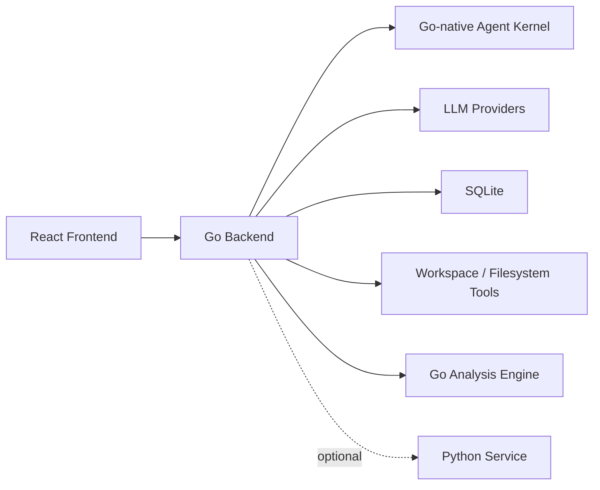

# ZhikunCode Go 迁移与 Agent Kernel 开发计划

本文档用于指导把 ZhikunCode 的 Java 后端逐步替换为 Go 后端，并在 Go 中重新实现一个 Go-native 的 Agent Kernel。目标不是机械翻译 Java 代码，而是借现有项目学习 Go 后端、LLM 工具调用循环、多 Agent 并发协作和后续 Python 能力迁移。

## 1. 总体目标

最终目标架构：



阶段性目标：

- 保留现有 React 前端。
- 保留现有 Python Service，先由 Go 调用它。
- 新建 `go-backend`，与 Java 后端并行开发。
- 先替换 REST 能力，再替换聊天流和工具调用。
- 在 Go 内部重写 QueryEngine、ToolRegistry、Permission、SubAgent、Coordinator。
- 后期逐步把 Python Service 的通用能力迁入 Go。

## 2. 迁移原则

- 先跑通最小闭环，再追求功能完整。
- Go 代码按 Go 的习惯设计，不照搬 Java 类结构。
- Java 后端先保留，Go 后端默认跑在 `8081`，避免影响当前项目。
- Python Service 继续跑在 `8000`。
- 前端先只接入 Go 的少量 REST/SSE 接口，WebSocket 后续再替换。
- 每个阶段都要有可运行、可测试、可回退的结果。

## 3. 当前系统关系

现有架构大致是：

```text
React Frontend
  -> Java Spring Boot Backend :8080
       -> LLM Provider
       -> SQLite
       -> Python Service :8000
```

Java 后端当前负责：

- 前端 WebSocket/STOMP 消息通道
- REST/SSE 查询接口
- 会话、权限、工具调用、LLM 编排
- 多 Agent / SubAgent / Coordinator
- SQLite 持久化
- Python 能力探测和 HTTP 调用

Python Service 当前负责：

- token 计数
- 代码分析
- API endpoint 扫描
- 调用链追踪
- Mermaid 图生成
- 浏览器自动化
- 文件处理和代码智能能力

## 4. 推荐目录结构

在仓库根目录新增：

```text
go-backend/
  go.mod
  cmd/
    server/
      main.go
  internal/
    api/
      router.go
      health_handler.go
      query_handler.go
      stream_handler.go
      websocket_handler.go
    config/
      config.go
    storage/
      sqlite.go
      migrations.go
    session/
      message.go
      session.go
      repository.go
      service.go
    llm/
      client.go
      openai_compatible.go
      stream.go
      models.go
    engine/
      query_engine.go
      events.go
      state.go
      prompt.go
    tools/
      tool.go
      registry.go
      read_file.go
      list_files.go
      write_file.go
      bash.go
      python_analysis.go
    permission/
      mode.go
      request.go
      broker.go
      policy.go
    agent/
      agent.go
      subagent.go
      coordinator.go
      task.go
      aggregator.go
    python/
      client.go
      capabilities.go
      analysis.go
      tokenizer.go
    workspace/
      boundary.go
      path.go
    protocol/
      dto.go
      errors.go
```

建议 Go 技术栈：

```text
HTTP router:      github.com/go-chi/chi/v5
WebSocket:        nhooyr.io/websocket
SQLite:           modernc.org/sqlite 或 github.com/mattn/go-sqlite3
Config:           标准库 os + env，后续再引入 viper
Logging:          log/slog
Testing:          标准库 testing
LLM HTTP client:  标准库 net/http
```

## 5. 第一阶段：Go Backend MVP

目标：Go 后端能独立启动，提供基础接口，不影响 Java。

默认端口：

```text
Go Backend:      http://localhost:8081
Java Backend:    http://localhost:8080
Python Service:  http://localhost:8000
Frontend:        http://localhost:5173
```

实现接口：

```text
GET /api/health
GET /api/doctor
GET /api/config
```

验收标准：

- `go run ./cmd/server` 能启动。
- `/api/health` 返回服务名、版本、启动时间。
- `/api/doctor` 能检查 Go、Python Service、SQLite、工作目录。
- 不修改 Java 后端。

## 6. 第二阶段：Go 调 Python Service

目标：替换 Java 中的 `PythonCapabilityAwareClient` 这一类能力。

Go 需要调用：

```text
GET  http://localhost:8000/api/health
GET  http://localhost:8000/api/health/capabilities
POST http://localhost:8000/api/tokenizer/count
POST http://localhost:8000/api/analysis/generate-diagram
POST http://localhost:8000/api/analysis/api-endpoints
POST http://localhost:8000/api/analysis/code-path
```

Go 对外提供：

```text
GET  /api/python/capabilities
POST /api/tokenizer/count
POST /api/code-diagrams/generate
POST /api/code-path/endpoints
POST /api/code-path/trace
```

关键设计：

```go
type PythonClient struct {
    BaseURL string
    HTTP    *http.Client
}

func (c *PythonClient) Capabilities(ctx context.Context) (Capabilities, error)
func (c *PythonClient) CountTokens(ctx context.Context, req TokenCountRequest) (TokenCountResponse, error)
func (c *PythonClient) GenerateDiagram(ctx context.Context, req DiagramRequest) (DiagramResponse, error)
```

验收标准：

- Go 能读取 Python capability。
- Go 能调用 Python tokenizer。
- Go 能调用 Python 生成 Mermaid 图。
- Python 不可用时，Go 返回明确错误，不崩溃。

## 7. 第三阶段：Go LLM Client

目标：实现 OpenAI-compatible API 客户端，先支持非流式，再支持流式。

支持 provider：

```text
DashScope
DeepSeek
Moonshot
OpenAI-compatible custom base URL
```

配置环境变量：

```text
LLM_BASE_URL=https://dashscope.aliyuncs.com/compatible-mode/v1
LLM_API_KEY=...
LLM_DEFAULT_MODEL=qwen3.7-max
```

核心接口：

```go
type LLMClient interface {
    Chat(ctx context.Context, req ChatRequest) (ChatResponse, error)
    Stream(ctx context.Context, req ChatRequest) (<-chan LLMEvent, error)
}
```

验收标准：

- `POST /api/query` 能返回一次完整回答。
- LLM 错误、超时、401、429 都有明确错误类型。
- 不依赖 Java 后端。

## 8. 第四阶段：Go-native QueryEngine v0

目标：实现最小对话循环，只支持纯文本，无工具调用。

流程：

```text
User Message
  -> build system prompt
  -> append history
  -> call LLM
  -> save assistant message
  -> return final text
```

核心结构：

```go
type QueryEngine struct {
    LLM      llm.LLMClient
    Sessions session.Service
}

type QueryRequest struct {
    SessionID string
    Model     string
    Prompt    string
}

type QueryResult struct {
    SessionID string
    Text      string
    Usage     Usage
}
```

验收标准：

- 支持创建 session。
- 支持连续多轮对话。
- 消息持久化到 SQLite。
- 支持简单 system prompt。

## 9. 第五阶段：Tool Calling

目标：实现 agent 最核心的工具循环。

核心循环：

```text
User Message
  -> LLM
  -> if text: finish
  -> if tool_call:
       -> find tool
       -> permission check
       -> run tool
       -> append tool_result
       -> continue
```

核心接口：

```go
type Tool interface {
    Name() string
    Description() string
    Schema() any
    Run(ctx context.Context, input json.RawMessage) (ToolResult, error)
}

type ToolRegistry interface {
    Register(tool Tool)
    Get(name string) (Tool, bool)
    Definitions() []ToolDefinition
}
```

第一批工具：

```text
list_files
read_file
write_file
python_analysis
token_count
```

先不要实现危险的 shell 工具。等权限系统稳定后再加。

验收标准：

- LLM 能调用 `read_file`。
- LLM 能调用 `python_analysis`。
- 工具结果能回填给 LLM。
- 最大循环轮数可配置，避免死循环。

## 10. 第六阶段：流式输出

目标：Go 后端能把 agent 运行过程推给前端。

建议先用 SSE：

```text
POST /api/query/stream
```

事件类型：

```text
message_start
stream_delta
tool_use_start
tool_use_progress
tool_result
permission_request
message_complete
error
```

Go 事件模型：

```go
type Event struct {
    Type      string `json:"type"`
    SessionID string `json:"sessionId,omitempty"`
    Delta     string `json:"delta,omitempty"`
    ToolName  string `json:"toolName,omitempty"`
    ToolUseID string `json:"toolUseId,omitempty"`
    Payload   any    `json:"payload,omitempty"`
}
```

验收标准：

- 前端或 curl 能看到 token 增量。
- 工具调用开始和结束都有事件。
- 出错时 SSE 正常结束。

## 11. 第七阶段：权限系统

目标：工具执行前做权限判断。

权限模式：

```text
read_only
read_write
ask
auto
deny_all
```

规则：

- `read_file` 默认允许。
- `list_files` 默认允许。
- `write_file` 默认需要确认。
- shell 类工具默认需要确认。
- 超出 workspace 边界的路径必须拒绝。

核心接口：

```go
type PermissionBroker interface {
    Request(ctx context.Context, req PermissionRequest) (PermissionDecision, error)
}

type PermissionPolicy interface {
    Decide(req PermissionRequest) DecisionHint
}
```

验收标准：

- 危险工具不会直接执行。
- 前端可以批准或拒绝工具。
- 用户拒绝后，tool_result 告知 LLM 权限被拒。

## 12. 第八阶段：SubAgent

目标：主 agent 可以创建子 agent 执行独立任务。

最小模型：

```text
Main Agent
  -> task_create
  -> SubAgent goroutine
  -> SubAgent runs QueryEngine
  -> result returns to Main Agent
```

核心结构：

```go
type Agent struct {
    ID      string
    Engine  *engine.QueryEngine
    Tools   tools.Registry
}

type Task struct {
    ID          string
    ParentID    string
    Instruction string
    Status      string
}
```

Go 并发模型：

```go
ctx, cancel := context.WithCancel(parentCtx)
resultCh := make(chan AgentResult, 1)

go func() {
    resultCh <- subAgent.Run(ctx, task)
}()
```

验收标准：

- 主 agent 能创建一个子 agent。
- 子 agent 独立执行，结果返回主 agent。
- 父 context cancel 后，子 agent 停止。

## 13. 第九阶段：Coordinator / Multi-Agent

目标：实现多 Agent 分工、并发执行和汇总。

最小流程：

```text
Coordinator
  -> plan tasks
  -> run workers concurrently
  -> collect results
  -> aggregate final answer
```

核心组件：

```text
Coordinator
TaskPlanner
WorkerAgent
Mailbox
Aggregator
PermissionBridge
```

Go 学习点：

- goroutine 管理 worker
- channel 汇总结果
- context 取消整组任务
- timeout 控制
- error group 或 WaitGroup

验收标准：

- 能同时启动多个 worker。
- 任一 worker 失败不会导致整体失控。
- Coordinator 能汇总结果。
- 可限制最大并发数。

## 14. 后期：逐步替换 Python Service

Python 不必一开始替换。推荐顺序：

| Python 能力 | Go 替换优先级 | 说明 |
|---|---:|---|
| health / capability | 高 | 简单，适合作为第一个迁移点 |
| token 估算 | 高 | 可先启发式，后续接 tokenizer |
| 文件处理 | 高 | Go 标准库足够 |
| Git 增强 | 高 | 可用 `go-git` 或直接调用 `git` |
| Mermaid 图生成 | 中高 | 主要是格式化分析结果 |
| API endpoint 扫描 | 中 | 可用 tree-sitter-go |
| 调用图 / 代码路径 | 中 | 工作量较大 |
| 浏览器自动化 | 中 | 可用 chromedp，但 Playwright 更成熟 |
| Python AST / Jedi / Rope | 低 | Python 生态优势明显 |

最终可以变为：

```text
Go Backend
  -> Go Agent Kernel
  -> Go Analysis Engine
  -> optional Python Plugin
```

## 15. 与前端的迁移策略

第一阶段不要强行兼容 Spring STOMP/SockJS。

推荐路径：

1. 前端保留旧 Java 连接。
2. 新增 Go API client，用于测试 `/api/query` 和 `/api/query/stream`。
3. 单独做一个 Go Chat 页面或开发开关。
4. Go SSE 稳定后，再替换主聊天流。
5. 最后视情况实现普通 WebSocket。

临时环境变量：

```text
VITE_JAVA_API_BASE=http://localhost:8080
VITE_GO_API_BASE=http://localhost:8081
```

## 16. 建议开发顺序清单

- [ ] 新建 `go-backend/go.mod`
- [ ] 实现 `cmd/server/main.go`
- [ ] 实现 config 和 slog 日志
- [ ] 实现 `/api/health`
- [ ] 实现 `/api/doctor`
- [ ] 实现 Python client
- [ ] 实现 `/api/python/capabilities`
- [ ] 实现 `/api/tokenizer/count`
- [ ] 实现 `/api/code-diagrams/generate`
- [ ] 实现 LLM client
- [ ] 实现 `/api/query`
- [ ] 实现 SQLite session/message
- [ ] 实现 QueryEngine v0
- [ ] 实现 Tool interface 和 registry
- [ ] 实现 read/list/write/python tools
- [ ] 实现 SSE stream
- [ ] 实现 permission broker
- [ ] 实现 SubAgent
- [ ] 实现 Coordinator
- [ ] 按能力迁移 Python Service

## 17. 每个阶段的完成定义

每个阶段必须满足：

- 能本地启动。
- 有最小测试或 curl 验证。
- 错误路径有明确返回。
- 不破坏现有 Java/Python/Frontend 的启动方式。
- 文档记录新增接口和环境变量。

## 18. 第一周推荐任务

第一周只做 Go 后端骨架和 Python 调用，不碰 Agent。

推荐目标：

```text
Day 1: go-backend 初始化，health/doctor
Day 2: Python client + capabilities
Day 3: tokenizer/count
Day 4: code-diagrams/generate
Day 5: config/logging/error response 整理
Day 6: 写测试
Day 7: 总结和准备 LLM client
```

第一周结束时应该能做到：

```bash
cd go-backend
go run ./cmd/server
```

然后：

```bash
curl http://localhost:8081/api/health
curl http://localhost:8081/api/python/capabilities
```

## 19. 第二周推荐任务

第二周开始做 LLM 和 QueryEngine。

推荐目标：

```text
Day 1: OpenAI-compatible request/response DTO
Day 2: 非流式 Chat
Day 3: /api/query
Day 4: SQLite session/message
Day 5: QueryEngine v0
Day 6: 多轮对话
Day 7: 错误处理和测试
```

## 20. 第三周推荐任务

第三周做工具调用。

推荐目标：

```text
Day 1: Tool interface
Day 2: ToolRegistry
Day 3: read_file/list_files
Day 4: write_file + workspace boundary
Day 5: python_analysis tool
Day 6: QueryEngine tool loop
Day 7: 最大轮数、错误恢复、测试
```

## 21. 第四周推荐任务

第四周做流式输出和权限。

推荐目标：

```text
Day 1: SSE event model
Day 2: LLM streaming
Day 3: tool event streaming
Day 4: PermissionRequest
Day 5: PermissionBroker
Day 6: 前端最小接入
Day 7: 联调和测试
```

## 22. 关键提醒

- 不要一开始重写全部 Java。
- 不要一开始追求完整 STOMP 兼容。
- 不要一开始做 shell 工具，先把文件和 Python 分析工具做好。
- QueryEngine 必须有最大轮数。
- 所有工具都必须走 workspace 路径边界检查。
- 所有外部调用都必须带 context timeout。
- 多 Agent 一定要先做 cancel 和 timeout，再做复杂协作。

## 23. 推荐的第一个 PR / Commit 范围

第一个开发提交建议只包含：

```text
go-backend/go.mod
go-backend/cmd/server/main.go
go-backend/internal/config/config.go
go-backend/internal/api/router.go
go-backend/internal/api/health_handler.go
go-backend/internal/python/client.go
go-backend/internal/python/capabilities.go
```

对应能力：

```text
GET /api/health
GET /api/doctor
GET /api/python/capabilities
```

这个范围最适合开局：清晰、能跑、能学 Go 的 HTTP/config/context/error 处理，也能马上接上现有 Python Service。
